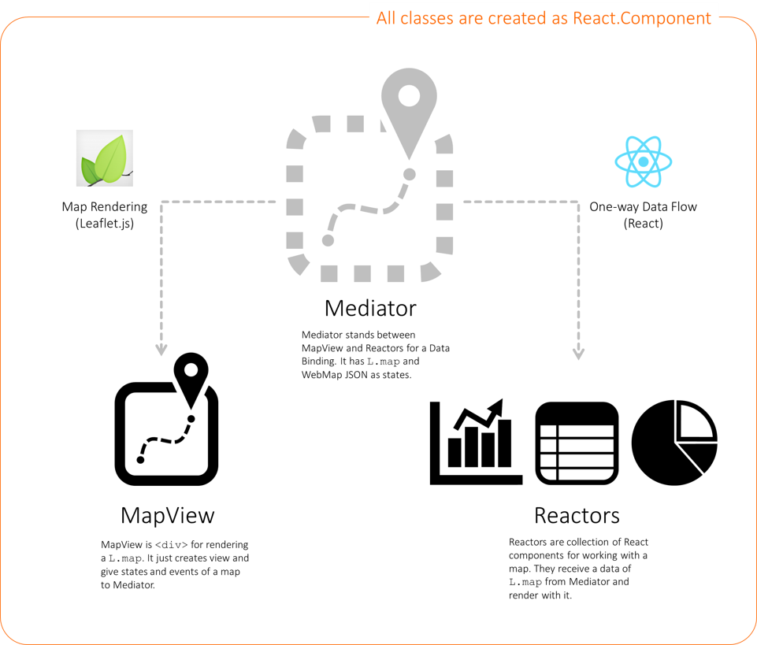

# React WebMap Framework

__WORK IN PROGRESS..__

This framework combine two libraries as [Leaflet.js](http://leafletjs.com/) and [React](https://facebook.github.io/react/).
It think how web mapping library like Leaflet.js coexist with concepts of React.

It does not use Shadow DOM for rendering a map and configuring layers because `L.map` do all these for mapping. But it is low reusability to define states of a map and configure layers in Leaflet.js.. Therefore, it uses [ArcGIS Web Map](https://developers.arcgis.com/web-map-specification/) to put full information for mapping data out. It is able to initialize a structure just with web map id.



See [the live demo](https://ynunokawa.github.io/react-webmap/).


## Usage

Install `react-webmap` via npm.

```
npm i react-webmap
```

Import `Mediator` component from the library.

```js
import { Mediator } from 'react-webmap';
```

Add the component to your `render` function:

```js
const mapid = '55e02e777274468c90745fde6641faf4'; // You can get mapid from ArcGIS!
ReactDOM.render(<Mediator mapid={mapid} />, container);
```

You can get a `mapid` from [ArcGIS.com](https://www.arcgis.com/home). See [Make your first map](http://doc.arcgis.com/arcgis-online/create-maps/make-your-first-map.htm).


## Development Instructions

You can create new Reactor or improve the framework for Mediator or Reactors as the below.

1. Fork and clone react-webmap
2. `cd` into the `react-webmap` folder
3. Install the dependencies with `npm install`
4. Run `npm run build` from the command line. This will compile JSX in a brand new `dist` directory.
5. Run `npm run start` to compile an example codes to minified source in a `docs` directory and launch a tiny webserver.
6. ~~Run `npm test` to make sure you haven't introduced a new 'feature' accidentally.~~ (
IN PREPARATION)
7. Make your changes __in its own topic branch__ and create a pull request!


## Recipe for Reactor

1. Make a directory (e.g. `HomeButton`) for new Reactor into `src/example/reactors`.
2. Make and open a js file (e.g. `HomeButton.js`) in your text editor.
3. Create new class (named the same of the file) extend `React.Component` with ES2015.
4. Define `props` (e.g. `center`, `zoom`) for getting data from a map via `Mediator`.
5. Make a function for render data or action to a map.
6. Make a event (e.g. `<Button onClick={this._onGetHome}>` runs `this.props.onGetHome`) on Reactor to move a map or highlight data (OPTION)
7. Add new Reactor into `Mediator.js` with `import`.
8. Add new property into `Mediator.props` to initialize your Reactor (OPTION).
9. Add JSX markup of new Reactor (e.g. `<HomeButton />`) into `render()` of `Mediator`.
10. Set `props` into JSX (e.g. `<HomeButton center={this.state.initialCenter}  zoom={this.state.initialZoom} />`) with `this.state`.
11. Add a funtion for using Leaflet methods and bind it with `this` (e.g. `this.fitBounds = this.fitBounds.bind(this);`) in the `load` event listner for `L.esri.webMap` (OPTION).

__HomeButton.js__
```js
import React from 'react';
import { Button, Glyphicon } from 'react-bootstrap';

class HomeButton extends React.Component {
  constructor (props) {
      super(props);
      this._onGetHome = this._onGetHome.bind(this);
  }

  _onGetHome () {
    this.props.onGetHome(this.props.center, this.props.zoom);
  }

  render () {
    return (
      <div>
        <Button onClick={this._onGetHome}>
          <Glyphicon glyph="home" />
        </Button>
      </div>
    );
  }
}

HomeButton.propTypes = {
  center: React.PropTypes.array,
  zoom: React.PropTypes.number,
  onGetHome: React.PropTypes.func
};

HomeButton.defaultProps = {
  center: [35, 139],
  zoom : 5,
  onGetHome: function () {}
};

HomeButton.displayName = 'HomeButton';

export default HomeButton;
```
